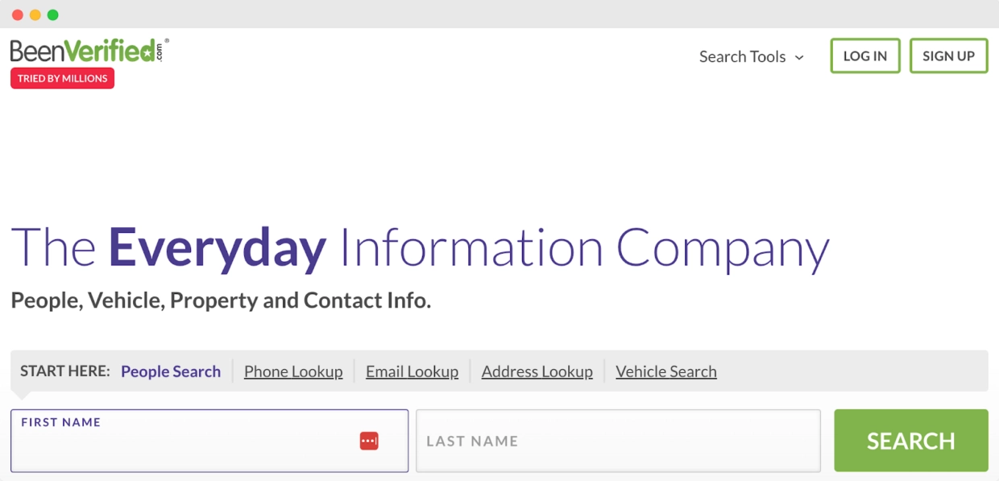
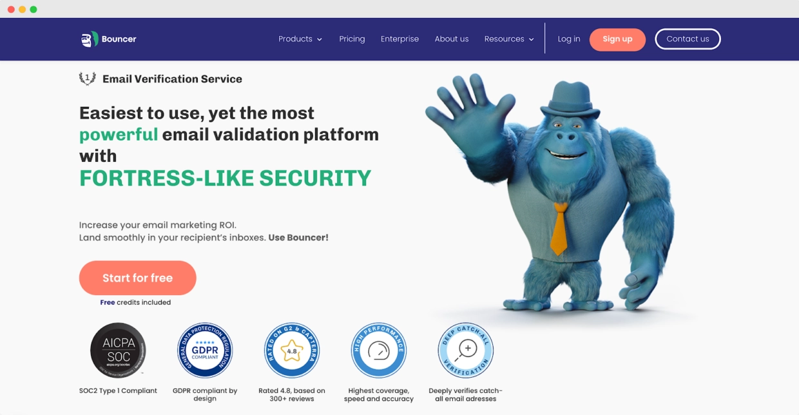

# BeenVerified替代品？这4个工具或许更适合你

觉得BeenVerified用着差点意思？

其实很多人都有这感觉。它做基础背景调查还行，但要说数据挖掘、邮件验证这种活儿，就有点力不从心了。如果你想找功能更专业、价格更合理的工具，选择其实挺多的。

下面介绍4个替代方案，看看哪个更对你的胃口。

---

## BeenVerified是什么？

BeenVerified是个在线搜索服务，主要收集公开记录，帮你找人、查房产这些。想快速查点背景资料，它确实方便也不贵。

用起来挺简单，电脑手机都能访问。不过他们好像没有原生移动应用，只有网页版。

你可以从BeenVerified导出表格数据，然后导入CRM系统做数据补充。虽然没有现成的集成接口有点麻烦，但用来批量个性化外联还是有帮助的。

**注意**：BeenVerified不是消费者报告机构，不能提供消费者报告。

### BeenVerified的功能

BeenVerified有一堆实用功能，能帮你更轻松地收集人或房产的信息：

- **人物搜索**：从公开记录里提取数据，能看到某人的住址历史、电话号码、社交媒体账号等等
- **反向电话查询**：接到陌生来电？用这功能能查出是谁打的，不用瞎猜了
- **反向地址查询**：看看某个地址住的是谁，或者了解一下某个社区
- **犯罪记录搜索**：查公开记录里的逮捕、法庭记录或定罪信息
- **反向邮箱查询**：查出邮箱背后是谁，识别垃圾邮件或验证身份很好用
- **房产记录**：获取房产所有权、抵押契约和估值信息——了解房子或建筑物很有用
- **无主资金搜索**：BeenVerified能查某人名下是否有无人认领的资金

这些功能让BeenVerified成为高效收集公开信息的便捷工具。

### BeenVerified的价格

BeenVerified提供两种主要的背景调查服务定价。一个月计划大约每月26.89美元。

如果打算用久一点，三个月计划更划算，每月17.48美元，按季度收费52.44美元。两种计划都给你每月100份报告。

两种计划功能一样，包括：

- 无限次人物搜索
- 犯罪记录
- 地址查询
- 反向电话查询

他们偶尔会推7天1美元试用，不过要在试用结束前取消，否则会自动扣费。BeenVerified不提供单次报告，必须订阅才能完全访问数据。

这价格在公开记录搜索领域还算有竞争力，但有用户指出[取消流程有点麻烦](https://www.trustpilot.com/reviews/66d73f494453b4dd00f516cf)，所以要盯紧账单。

你可能会问：BeenVerified靠谱吗？

嗯，它（基本）能做到承诺的事。基本——因为有时提供的数据不一致或过时。而且计费流程有点可疑。

但这个后面再说。

## 为什么要找BeenVerified的替代品？

- **BeenVerified主要是背景调查服务**，不是专业的数据补充平台。虽然能提供一些数据补充功能，但缺少专业工具的高级功能和集成
- **BeenVerified的数据可能是原始未处理的**，需要额外时间解读和集成到你的系统
- **使用BeenVerified信息有法律限制**，特别是在雇佣筛选等场景。这限制了某些数据补充用例的适用性
- **像Bouncer或ZoomInfo这样的数据补充工具**能访问更广泛的数据源，提供更完整准确的补充数据
- **这些平台通常有更好的集成能力**，能和各种CRM、营销自动化工具和数据库对接。用它们把补充数据整合到现有工作流程要容易得多
- **专业工具通常提供更多功能**，不只是基础数据补充，还有潜在客户评分、市场研究、邮件列表清理和个性化等，取决于你的具体需求

👉 想提升邮件营销效果？不妨[试试这个专业的邮件验证工具](https://www.scraperapi.com/?fp_ref=coupons)，数据准确率能让你的触达效果更上一层楼。

## 值得考虑的4个BeenVerified最佳替代品

BeenVerified可能是背景调查的热门选择，但不是唯一选项。如果你觉得价格太贵或功能不够用，你不是一个人。

市面上有很多替代品提供类似服务——有些甚至能以更好的价格提供更多功能。来看看这六个可能更适合你的选择。

### #1 Bouncer

Bouncer是领先的邮件验证和列表清理工具，专门帮企业提高邮件送达率、降低退信率。

它通过检查邮箱地址的有效性来工作，剔除无效地址，并补充剩余数据以提供更多洞察。

它以极高的准确性和易用性著称。Bouncer的突出之处在于速度和精度，专注于实时验证和大规模批量处理。

#### Bouncer的核心功能

- **邮件验证**：检查邮箱地址准确性，过滤无效、临时或风险地址
- **垃圾陷阱检测**：识别专门用来抓垃圾邮件发送者的有害邮箱
- **实时验证API**：用户在表单输入时即时验证邮箱
- **批量邮件验证**：处理海量列表，每小时可处理最多20万封邮件，准确率达99.5%
- **数据补充**：填充公司名称和行业等缺失信息

#### 为什么选择Bouncer

在数据补充和邮件验证方面，Bouncer比BeenVerified强太多了。

BeenVerified更多关注公开记录和人物搜索，而Bouncer是**专为优化邮件营销量身打造的**。

凭借实时验证和批量邮件清理功能，它能保持邮件列表的准确性和无垃圾性，有效控制退信率、提升整体送达率。

Bouncer的数据补充功能特别有用，能获得更深入的洞察，而不用强迫用户填写冗长的注册表单。

别光听我说，看看用户怎么评价：

"Bouncer最突出的特点之一是无与伦比的易用性。从开始使用的那一刻起，我就发现界面直观且用户友好。验证邮箱地址的过程简化高效，为我节省了宝贵的时间和精力。" [G2评论](https://www.g2.com/products/bouncer/reviews/bouncer-review-9517770)

"是同事告诉我Bouncer的。我之前都不知道有这种工具。哇，真是太棒了。我虽然不是重度邮件营销者，但一周也要发几百封。就我的使用体验来说，Bouncer完全胜任。" [G2评论](https://www.g2.com/products/bouncer/reviews/bouncer-review-9507451)

"Bouncer最好的地方在于非常简单快速。不用复杂设置，上传列表让它干活就行。我还喜欢可以自己控制使用哪个送达信心级别，而不是被迫接受他们认为最好的。把结果应用到我的邮件发送器也很简单。" [G2评论](https://www.g2.com/products/bouncer/reviews/bouncer-review-9507527)

#### Bouncer的价格

Bouncer采用灵活的按需付费模式。对各种规模的企业都很实惠。低至**每封验证邮件0.0015美元**起，非常适合想有效控制成本的公司。

如果你专注于邮件验证和提升营销表现，Bouncer是绝佳选择。

[立即试用Bouncer！](https://app.usebouncer.com/signup)

### #2 Spokeo

Spokeo是在线人物搜索引擎，从公开记录、社交媒体资料等来源提取数据。

常用于查找联系信息或背景详情。虽然Spokeo有庞大的数据库,用户对结果准确性和公司订阅做法提出了担忧，特别是7天试用后的计费问题。

#### Spokeo的核心功能

- **人物搜索**：访问公开记录查找联系详情
- **反向电话查询**：帮助识别陌生来电者
- **邮箱搜索**：追踪与邮箱地址相关的信息
- **房产搜索**：检索房产所有权和价值数据

#### Spokeo的优点

- 0.95美元的实惠试用期
- 用户友好的界面
- 适合基础联系信息搜索
- 多种会员选项

#### Spokeo的缺点

- 订阅续订做法不够透明 [TrustPilot评论](https://www.trustpilot.com/reviews/66da87c2eb312eb0d07c3602)

- 客户支持体验参差不齐 [TrustPilot评论](https://www.trustpilot.com/reviews/66deecdd9b57fe530df8b37f)

- 重度用户的专业计划价格较高

#### Spokeo的价格

- **7天试用**：0.95美元，续订为**29.95美元/月**
- **1个月会员**：19.95美元/月，可进行100次搜索
- **3个月会员**：14.95美元/月，按季度收费44.85美元
- **专业计划**：69.95美元/月，可进行500次搜索

总的来说，Spokeo对于需要基础信息的人是个不错选择，但其自动续订政策和客户服务招致批评。一定要留意订阅状态，避免意外扣费。

### #3 BriteVerify

BriteVerify是邮件验证工具，专注于清理和验证邮件列表以提高送达率。

它检查邮箱地址的格式错误，验证域名，确认邮箱是否活跃。

虽然对基础列表清理很有效，但一些用户指出它在处理垃圾陷阱和重复条目等更复杂邮件问题方面存在局限。

#### BriteVerify的核心功能

- **批量邮件验证**：验证最多100万个地址的大型列表
- **实时API**：在注册表单提交时即时验证邮箱
- **多用户账户**：允许团队使用一个账户添加多个用户
- **拖放界面**：通过拖放功能轻松在平台内执行任务
- **域名和语法验证**：检查正确的邮箱格式，验证域名的MX记录确认其有效性

#### BriteVerify的优点

- 简单易用
- 快速邮件验证，特别适合批量列表
- 灵活的按需付费定价模式

#### BriteVerify的缺点

- 不能删除重复项，需要手动清理

- 缺少垃圾陷阱检测或送达率工具等高级功能
- 分析结果不如Bouncer等竞争对手那么细致 [G2评论](https://www.g2.com/products/briteverify/reviews/briteverify-review-9695309)

#### BriteVerify的价格

按需付费定价从**每封验证邮件0.01美元**起。也提供订阅计划供常规使用，但功能有限。

总的来说，BriteVerify适合快速邮件验证，但在更高级的邮件列表管理方面不如BeenVerified或Bouncer等服务。

### #4 Clearout

Clearout是邮件验证和查找工具，旨在帮助企业维护高质量的邮件列表。

它以实时或批量验证邮箱而闻名，能识别垃圾陷阱，处理拼写错误和临时邮箱等问题。它还通过AI驱动的邮箱查找器提供数据补充，可以根据姓名和域名发现邮箱地址。

Clearout与主要ESP/CRM、在线表单和Google Sheets集成，对于寻求准确且合规数据管理的企业来说是灵活的选择。

#### Clearout的核心功能

- **邮件验证**：以99%的准确率删除无效和风险邮箱地址
- **邮箱查找器**：使用AI根据姓名和域名定位商务邮箱
- **LinkedIn邮箱查找器**：直接从LinkedIn提取潜在客户，助力B2B开发
- **实时API**：在表单提交期间即时验证邮箱

#### Clearout的优点

- 高准确率，具有垃圾陷阱和catch-all检测
- 与Google Sheets和LinkedIn等流行平台无缝集成
- 灵活的按需付费定价

#### Clearout的缺点

- 与不太常见的邮件提供商集成有限 [G2评论](https://www.g2.com/products/clearout-io/reviews/clearout-io-review-2773360)

- 大型邮件列表验证过程较慢 [G2评论](https://www.g2.com/products/clearout-io/reviews/clearout-io-review-8666666)

- 应用看起来过时，界面笨重 [G2评论](https://www.g2.com/products/clearout-io/reviews/clearout-io-review-8711851)

#### Clearout的价格

Clearout从**3000个积分21美元**起，根据验证或查找的邮箱数量进行扩展。

总的来说，Clearout是可靠的邮件验证工具，提供良好的准确性和集成，但可能不如某些替代品那么快速或多功能。

## 总结

说到底，选择合适的工具取决于你真正需要什么。

如果BeenVerified无法满足你的特定任务——比如大规模数据补充或更详细的邮件验证——还有其他选择可以填补这些空白。

像Bouncer这样的工具提供专业功能，能更好地满足有深度邮件营销或数据需求的企业。

重要的是仔细权衡选择，记住每项服务如何适配你的工作流程和目标。

如果你在寻找准确、快速、易用的顶级邮件验证，**Bouncer**是绝佳选择。

凭借灵活的定价和实时验证，它能帮你保持邮件列表清洁，提升营销活动成功率。想让你的邮件营销更上一层楼？👉 [现在就试试这个专业工具](https://www.scraperapi.com/?fp_ref=coupons)，数据准确度会让你的效果大不一样。

